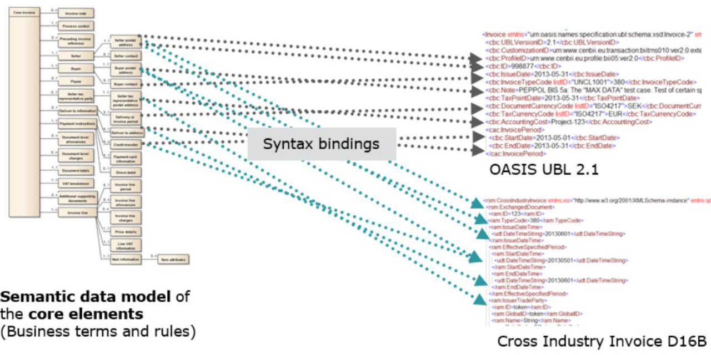

# Semantic-Crosswalk-Editor

Editor to improve Data Interoperability by bridging Standards using human-centric Semantics.

## Overview

The **purpose** of this project is to enhance the data portability of standards. 

"I love standards there are so many to choose from" -- Marshall T. Rose.

The focus of IDSS is to develop a suite of tools to assist cross metadata (semantic) translation for domain experts. In contrast to initiatives such as the "Semantic Web" we don't build up from a projected ontology as there is no single way to model a domain using an ontology. There is no global truth. Different stakeholders in the domain may consider different semantics for metadata or even hold contradictory claims. Often metadata is designed to be intentionally vague and open to widest range of interpretations and implementations-- see, for example, Dublin Core. The real-world is messy and filled with interoperability issues. In standardization we need to solve them beforehand through interlingua concensus constructed upon formal controlled vocabularies. These demand tools that are not the same as what people tried to develop for the "Semantic Web".. we use the data and some tools but don't follow their paradigm down the rabbit hole.

### Interginga Translation

Interlingual machine translation is one of the classic approaches to machine translation. In this approach, the source language, i.e. the text to be translated is transformed into an interlingua, i.e., an abstract language-independent representation. The target language is then generated from the interlingua. Within the rule-based machine translation paradigm, the interlingual approach is an alternative to the direct approach and the transfer approach.

In the direct approach, words are translated directly without passing through an additional representation. In the transfer approach the source language is transformed into an abstract, less language-specific representation. Linguistic rules which are specific to the language pair then transform the source language representation into an abstract target language representation and from this the target sentence is generated.

With an interlingua it becomes unnecessary to make a translation pair between each pair of languages in the system. So instead of creating n ( n − 1 ) language pairs, where n is the number of languages in the system, it is only necessary to make 2 n  pairs between the n languages and the interlingua. 

The first ideas about interlingual machine translation appeared in the 17th century with Descartes and Leibniz who came up with theories of how to create dictionaries using universal numerical codes.  These codes in our context are not much different from OIDs (Object IDs): an identifier mechanism standardized by the International Telecommunication Union (ITU) and ISO/IEC for naming any object, concept, or "thing" with a globally unambiguous persistent name. OIDs, formally defined by ITU X.660, are themselves managed by shareholder groups much like DNS domains with a given OID corresponding to a node in the "OID tree". See: 
* https://www.itu.int/dms_pub/itu-t/oth/0B/04/T0B040000482C01PDFE.pdf (brochure on OIDs)
* http://www.oid-info.com/ (Object Identifier (OID) Repository). 

In our initial release we support only single endges between metadata elements but in the future we'll allow n-to-m to support entirely generic designs.

In IDISS we follow this mode. In the future we hope to provide some machine learning tools to ease in use cases lacking highly qualified domain experts to assist the process of mapping.

## Syntax / Encodings.

Although are targests are generic metadata standards and don't care about their encoding we start with XML as (syntax) language given its wide use in some of our initial study cases, especially electronic invoices. XML carries, unfortunately, also some baggage, so part of our functionality demands have been to provide validation: syntactical, consistentency and completeness checks.

Our **first milestone objective** has been the provide Minimum Viable Product (MVP) to interested parties.

We have chosen for the initial "real-world" usage scenario of our tools, the task of maintaining the syntax binding of the EU e-procurement (EU CEN Standard EN16931).

With our MVP we want to show how domain experts are able to easily align their semantics - here given by the CEN technical committee 434 (EN16931-1) - with the related given syntax, in our showcase the e-procurement XML syntax Cross Industry Invoice (CII) defined by the UN/CEFACT.

## High level Concept

* [Reused Free Open Source Software (FOSS) Modules - Standing on Shoulders of Giants](docs/Foss.md).
* [Basics on the European e-Invoice Specification (EN16931)](docs/EN16931.md).

## User Documentation

* [Getting Started](docs/GettingStarted.md): How to install the Semantic Crosswalk Editor and get started with Syntax Bindings.
* [Optimizing Workspace](docs/OptimizingWorkspace.md): Setting up the workspace to improve workflow with the SCE extension.
* [SCE Features](docs/Features.md): Comprehensive list of the Semantic Crosswalk Editor key features (with animations to show them in action).
* [XML Features](https://github.com/DAPSI-IDISS/vscode-xml/tree/IDISS/docs):
  Everything about the underneath XML extension (validation, preferences, formatting, etc).

## Developer Documentation

* [SCE Development](docs/Development.md): How to build and contribute to the Semantic Crosswalk Editor extension.
* [XML Extensions](https://github.com/DAPSI-IDISS/vscode-xml/tree/IDISS/docs/Extensions.md#extensions):
  How to extend VSCode XML and LemMinX features (completion, validation, hover, etc).

## Endorsements

### [Paul Simons](https://www.linkedin.com/in/paulsimonscb/), Convenor TC434 WG1. Semantic data model

This work is important for the further development and standardisation of e-invoicing in general and more specific to the EN16931 developed by the CEN/TC434 Workgroup.
It will

* Enhance interoperability between the different ERP/Accounting software solutions in the market to the benefit of end-users
* Increase the accuracy of calculations
* Guarantee calculation results independent of the development tools and environment
* Resolve rounding issues in a transparent and predictable way

### [Fred van Blommestein](https://www.linkedin.com/in/fred-van-blommestein-7871b43/), editor of EN16931-1 and convenor of CEN/TC434 WG3 (Syntax binding)

TC434 has limited resources, especially with regard to the very technical work of syntax binding of semantic standards, which needs highly specialized expertise. Two projects within TC434 soon will need this effort: the amendment of EN16931-1 (the semantic standard for an electronic invoice) and the semantic standard for an electronic receipt. The tooling that is developed in this solution is indispensable for this work.

## Supported by

	

	<b>Data Portability & Services Incubator (DAPSI) program</b> - <a href="https://dapsi.ngi.eu/">https://dapsi.ngi.eu/</a>  
	<b>EU Grant Agreement No.: 871498</b> - <a href="https://cordis.europa.eu/project/id/871498">https://cordis.europa.eu/project/id/871498</a>  
	<b>Call: H2020-ICT-2018-2020</b>

