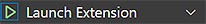

# Development

## Installation Prerequisites:

  * latest [Visual Studio Code](https://code.visualstudio.com/) (Insiders recommended)
  * [Node.js](https://nodejs.org/) at least v14.x.x (latest LTS recommended)
  * [Yarn](https://classic.yarnpkg.com/en/docs/install#windows-stable) Classic Stable (^v1.22.4 recommended)

## Building (Develop with Watcher)

1. Clone this repository and cd to the project root
1. Install the dependencies:
	```bash
	$ yarn install
	```
1. To run the extension, start VSCode and open the 'Run and Debug' view from its Activity Bar (Ctrl+Shift+D).
1. Select and run 'Launch Extension' at the top left by hitting the green arrow:

	

	- The `npm: watch` command requires the [TypeScript + Webpack Problem Matchers](https://marketplace.visualstudio.com/items?itemName=amodio.tsl-problem-matcher) extension to be installed.

## Debugging Guides

- [Running and Debugging Your Extension](https://vscode.readthedocs.io/en/latest/extensions/debugging-extensions/)
- [Debugging in Visual Studio Code](https://code.visualstudio.com/docs/editor/debugging)
- [Diagnosing Terminal Issues](https://github.com/microsoft/vscode/wiki/Terminal-Issues#diagnosing-terminal-issues) - Particularly useful if error notifications or the terminal output not providing enough information (such as `The terminal process terminated with exit code: 1`)

## Building (Production Package)

1. Install VSCE ([The Visual Studio Code Extension Manager](https://github.com/microsoft/vscode-vsce#vsce)) globally via yarn:
	```bash
	$ yarn global add vsce
	```
	or via npm:
	```bash
	$ npm install -g vsce
	```
1. Follow the steps 1 and 2 from [Building (Develop with Watcher)](#building-develop-with-watcher)
1. In the project root, build the package by running:
	```bash
	$ yarn run package
	```
1. Install the resulting VSIX package `semantic-crosswalk-editor-0.xx.x.vsix` under VS Code -> Extensions (preferable in a VS Code Insiders instance):

	
