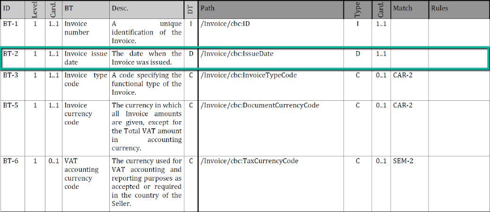
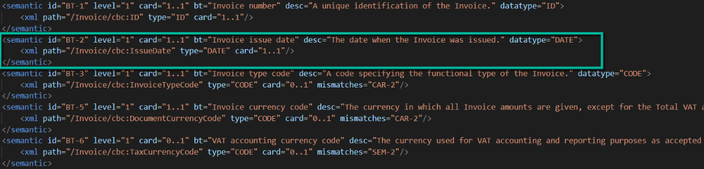
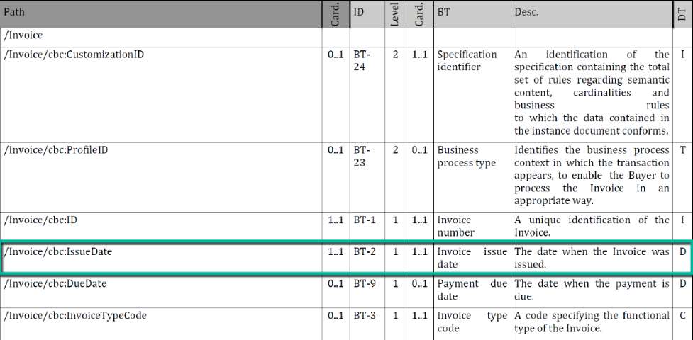
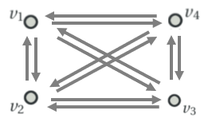
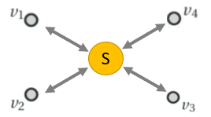

# Basics on the European e-Invoice Specification (EN16931)

## The EU e-Invoice Specification (EN16931)

There is [a wonderful online introduction for EN16931](https://ec.europa.eu/cefdigital/wiki/display/CEFDIGITAL/Compliance+with+eInvoicing+standard) given by the EU and [great presentation slides from CEF](https://ec.europa.eu/cefdigital/wiki/download/attachments/59180282/CEFeInvoicingWebinar%239UnderstandingUBL_CII_v1.0.pdf?version=1&modificationDate=1520420915552&api=v2).

## Specification EN16931-3: Details on Syntax Binding

The EU e-invoice specification demands the support of two XML file formats [OASIS UBL 1.2](http://docs.oasis-open.org/ubl/UBL-2.1.html) and [UN/CEFACT XML Industry Invoice D16B](https://www.unece.org/cefact/xml_schemas/index).

In its 3rd part (EN16931-3) - the deliverable of WG 3 of CEN TC434 - the EU specification binds the XML syntax with the EU e-invoice semantic. For each syntax exist a document, which contains at least two mapping table.

1. The first "normative table" (see below) describe the syntax binding from the semantic (light grey) to XML (dark grey),

2. Below the desired access to the normative syntax binding as structured XML data instead of PDF (digital paper/stone).

3. The second "informative table" (see below) describes it the other way around from XML (dark grey) to semantic (light grey).

The informative table (here Table 3) does not add any new information compared to its preceding sibling the normative table (here Table 2). The informative table starts with the XML part (dark grey), but uses only two of the five XML attributes from the prior normative table.
*NOTE:* In theory, the *exact complete data of the informative table* should already exist in the preceding normative table.

The above images where overtaken from [public EU webinar slides](https://ec.europa.eu/cefdigital/wiki/download/attachments/59180282/CEFeInvoicingWebinar%239UnderstandingUBL_CII_v1.0.pdf?version=1&modificationDate=1520420915552&api=v2).

## Software: EN16931 Data Extractor

The data extractor is a simple Java tool that can be called from command line. It reads from one or more office documents of EN16931-3 the containing syntax binding (or mapping) tables.
For each table, each row is being split into the:

- __XML part (dark grey)__
- __Semantic part (light grey)__

The data of each table is being saved in an own XML format to ease reading and testing the data set.
This new XML structure is straight forward: A list of semantic entities, each containing the corresponding XML elements as their children.

*NOTE:*
To ease comparison of a "normative table" from the specification with it's (hopefully identically) "informative table" twin, which has fewer XML columns, the normative table is being saved twice, once with all information and a second time as a subset equal to the informative table infoset, making file comparison easier.

## Contact with Semantic Providers 
In the context with our example domain the e-procurement, we identified, contacted and joined (if possible) the following providers of semantics on trading/e-Commerce:

    1. UN/CEFACT (subset of CII D16B is part of EN16931) Providing the CII XML for the EU Standard EN16931

    2. OASIS UBL Technical Committee (subset of UBL 2.1 is part of EN16931)

UBL is derived from the UN/CEFACT semantic but differs now in Semantic. Providing the UBL XML for the EU Standard EN16931

    3. CEN TC 434 WG1 Semantic (EN16931 semantic)

The semantic seems to be derived once from UBL but differs now.

    4. Connecting Europe Facility (CEF) digital (EN16931 code lists)
				
    5. CEN TC 440 (new EU Syntax Binding, e.g., e-Order)
		
    6. EU Semantic for e-Procurement (Semantic for CEN TC 440)
		
    7. ISO 154 (since 1972) "Processes, data elements and documents in commerce, industry and administration"
		
    8. ISO 321 (since 2018)  "Transaction assurance in E-commerce"
		
    9. GS1 domain documentation (published end of June 2021)

This work is complex and ongoing.

## Reducing Complexity of Transformations using Cross Walks

Our tool IDISS build bridges for **data silos!**

The problem of data silos is their data is not reusable by the next silo as the data types are different. A transformation of data from one silo to the next is required!
For the ubiquitous data exchange of 4 data silos (like vertexes in a graph) already 12 transformations (arrows) are required:

The Cross Walk is able to lower  the complexity of the transformations.
Instead of creating transformations between every data silos and this even twice to handle both directions, a shared semantic (S) is used as the common denominator between all silos/syntaxes. Every syntax is bound to the center semantic by a mapping we call “syntax binding” or “schema crosswalk” (each arrow)

In general, if there are “n” data silos, we just require “n” syntax bindings. But n*(n-1) transformations. (Close to quadratic n*n or n² but as the self-transformation does not exist, it is one less: n*(n-1)).
From the information of the syntax binding, all transformations can and will be generated!
So if there would be 1000 data silos, we can choose between establishing 1000 syntax bindings or 999.000 transformations to achive ubiquious data exchange.
A further advantage, each domain (silo/syntax) expert is able to focus only on its own syntax and does not have to be aware of the implementation details of all the other syntaxes (solely have to understand the shared center semantic).
Our first candidate for such a centered semantic is the UN/CEFACT data set being updated bi-yearly.
