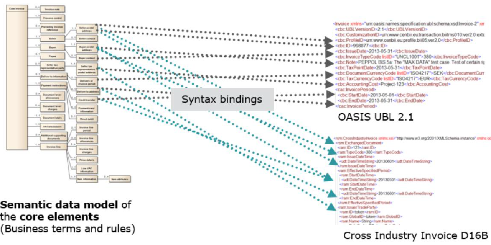

# Examples (Start of Case Studies)

Our **first milestone objective** has been the provide Minimum Viable Product (MVP) to interested parties.

## EU CEN Standard EN16931

We have chosen for the initial "real-world" usage scenario of our tools, the task of maintaining the syntax binding of the EU e-procurement (EU CEN Standard EN16931).

With our MVP we want to show how domain experts are able to easily align their semantics - here given by the CEN technical committee 434 (EN16931-1) - with the related given syntax, in our showcase the e-procurement XML syntax Cross Industry Invoice (CII) defined by the UN/CEFACT.
