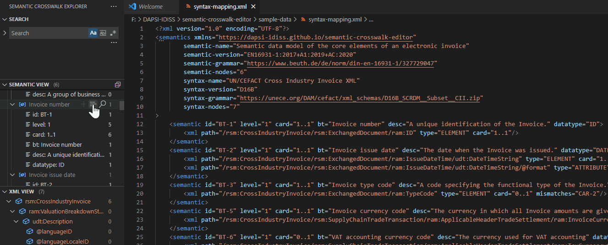

# Editor Features

As previously mentioned the IDISS tool ensemble and editor are not designed solely for XML but in the first stage implented with a focus on XML given its the Linguafranca of many of the standards we explore with the tools in its intial MVP phase.

While our targets are generic metadata standards and we don't care about the encoding but as XML is the (syntax) language in our initial study cases, especially electronic invoices, we could not ignore XML and its baggage. JSON was not an alternative. So part of our functionality demands has been to provide validation: syntactical, consistency and completeness checks.

## Semantic & XML View

The Semantic and XML View provides the core features for quickly searching through the available elements and existing mappings, and for easily creating new syntax mappings.

### Search & Filter

Providing a powerful search and filter functionality is one of the key goals for this project. The samples below demonstrate some use-cases.

#### Inline Search

The inline search (list-selection) icon highlights the matching values in the active Code Editor. Mainly used to quickly find relations of the selected items/values.

#### Open New Search (Search Editors)

The open search (lens) icon opens a new Search Editor. Which is especially useful to run multiple searches while keeping the previous results for later.

#### Open Search Editor from Inline Search

The Search Editor can be also opened from within an Inline Search result.

#### Search Highlight Outline

Search results are highlighted in the Outline Overview (thumbnail) and their positions are indicated at the Scroll Bar.

#### Find & Filter - Tree View Widget

Selecting a Tree View (Semantic or XML) and simply typing in there allows to quickly search in the View. A click on the filter icon (when hovering over the search term) switches to a filter-while-typing mode.

##### Additional Notes

Arrow keys can be used to navigate through the list, left and right arrows allow to collapse/expand. Pressing Ctrl+A (Cmd+A on macOS) in a tree will expand the tree's selection in a hierarchical fashion.  
Holding the Alt key while expanding/collapsing tree nodes will work recursively. Note that recursive expansion only works for nodes previously revealed in the tree.

### Create Syntax Mappings (Snippets)

Allowing to easily create complex mappings without typing a lot of code is another key feature we want to accomplish with this UI.

#### Add Semantic Items

Use the add icon on the Semantic View to insert a new Semantic snippet. The Semantic snippet node will be automatically placed in the order of id values and BT/BG groups, independent of the current cursor position or selection.

#### Add XML Items (Replace Placeholder)

Use the add icon on the XML View to insert a new XML snippet and replace a placeholder. The XML snippet node will automatically replace the comment if the current cursor position is between or on the related `<semantic></semantic>` elements.

#### Add XML Items (Append to Existing)

Use the add icon on the XML View to insert a new XML snippet and append it to existing XML elements. The XML snippet node will automatically append to the last found XML element relative to the current cursor position, between or on the related `<semantic></semantic>` elements.

### Reflected Editor Changes

#### Enablement, Highlighting and Badges

Changes to the active Code Editor (Text) will be reflected in the Semantic & XML View. Enablement of used/unused Semantics, Color Highlights, and Badges (Counters next to the Tree Item Labels) will be updated in an asynchronous fashion.

#### Counters (Nodes)

Global counters of the currently used nodes are synced across the UI:
* In the Code Editor  
  
* In the Status Bar  
  
* In the Tree Views  
  
* In the Status Messages  
  

## Outline View

We have extended the Code Outline View to provide a sortable list of the target paths of XML nodes in the currently opened Syntax Mapping file. Additonally showing the Line and Column numbers next to each outline element.

### Follow Cursor

Enable 'Follow Cursor' via the Outline settings (`...` next to the 'Outline' Label). The cursor and selection follows in both directions when selecting a line in the Outline View or the Code Editor.

  

### Breadcrumb Menu

The Breadcrumb Menu allows quick access to the same List of the Outline View. Selections from the Breadcrumb also apply to the Outline View and the Code Editor.

  

### Sorting

The Outline View also offers the option to sort the list by name or category while keeping the cursor follow intact.

  

## Code Editor

* [XML Features](https://github.com/DAPSI-IDISS/vscode-xml/tree/IDISS/docs/Features/XMLFeatures.md)
* [XSD Features](https://github.com/DAPSI-IDISS/vscode-xml/tree/IDISS/docs/Features/XSDFeatures.md)
* [DTD Features](https://github.com/DAPSI-IDISS/vscode-xml/tree/IDISS/docs/Features/DTDFeatures.md)
