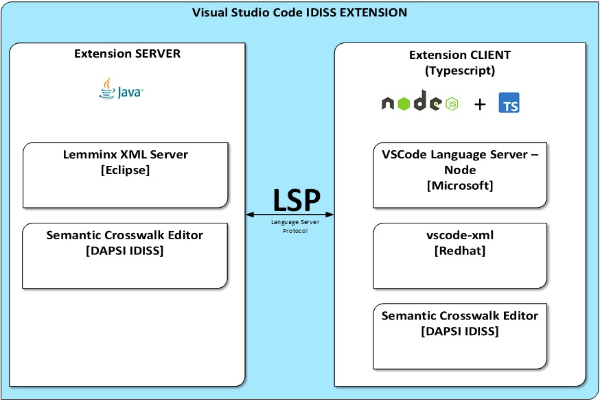

# Reused Free Open Source Software (FOSS) Modules

## Software Design and Architecture

### Java
For many components we use Java and its many libraries and infrastructure.

### Ontobase
OntoBase is a knowledge acquisition tool that simplifies data retrieval and manipulation over distributed databases. Built on Protégé knowledge editor it is a plug-in that turns Protégé into a simple database application. Users can compose new queries and editable forms from multiple tables and databases. OntoBase can be connected to any relational database- providing instant access to data, virtually without any programming. https://code.google.com/archive/p/ontobase/

### Protégé
Protégé provides a graphic user interface to define ontologies. It also includes deductive classifiers to validate that models are consistent and to infer new information based on the analysis of an ontology. https://protege.stanford.edu/

### WebOwl

"WebVOWL is a web application for the interactive visualization of ontologies. It implements the Visual Notation for OWL Ontologies (VOWL) by providing graphical depictions for elements of the Web Ontology Language (OWL) that are combined to a force-directed graph layout representing the ontology. Interaction techniques allow to explore the ontology and to customize the visualization. The VOWL visualizations are automatically generated from JSON files into which the ontologies need to be converted. A Java-based OWL2VOWL converter is provided along with WebVOWL. "
http://vowl.visualdataweb.org/webvowl.html

### Visual Studio

To be able to create such a helpful application within 9 months we did not reinvent the wheel, but instead stood upon the shoulders of the following giants:

1. We decided to embrace [Microsoft's open-source editor Visual Studio Code (VSCode)](https://code.visualstudio.com/) and its innovative open editor architecture based on its [Language Server Protocol (LSP)](https://microsoft.github.io/language-server-protocol/). With LSP it is possible to capsulate domain-specific business logic in a server part and to be able to share and reuse it by other editors, who split their specific needs in the client part. For instance, the HTML/CSS functionality from VSCode is now shared by [Eclipse IDE](https://projects.eclipse.org/projects/tools.wildwebdeveloper), eta.  The LSP vision is that in the future language providers may provide their own server extensions as part of their standard.
2. Our specific XML related functionality was in particular derived from the already existing preview of the open-source ["Visual Studio Code for XML" extension](https://marketplace.visualstudio.com/items?itemName=redhat.vscode-xml) governed by Red Hat & Eclipse.
3. Sophisticated analysis of XML syntax schema was only possible by extending the [open-source Multi-Schema Validator (MSV) library](https://github.com/xmlark/msv), which we extended to not only be used for validation but extract domain logic from the grammar.
The library’s differentiator is its capability of encapsulating the complexity of DTD, W3C Schema and RelaxNG grammars by a single [internal abstract representation](https://xmlark.github.io/msv/docs/nativeAPI.html#agm). One API to rule them all!
4. The extension of the [existing extractor for EU e-Invoice syntax binding](https://github.com/svanteschubert/en16931-data-extractor). A library that generated our sample XML syntax-binding and all required data for validation, completion, etc. from the office tables of the EN16931-3 EU CEN standard

It should be mentioned that understanding these giants often comes along with reading their source code - like reading a (huge) book - to understand their behaviour.
