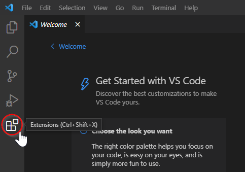
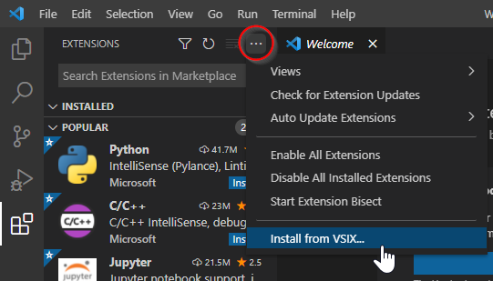
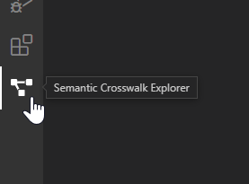
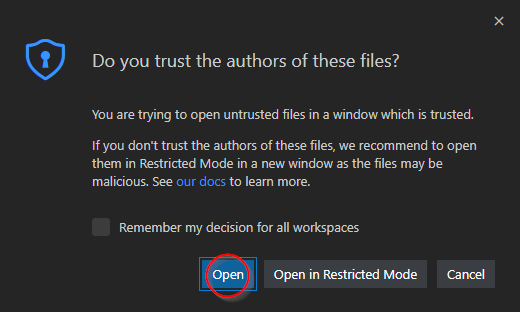
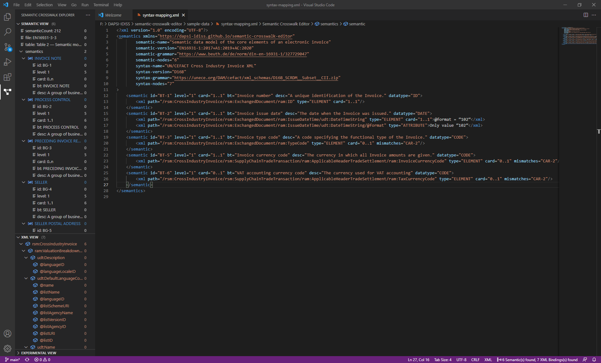
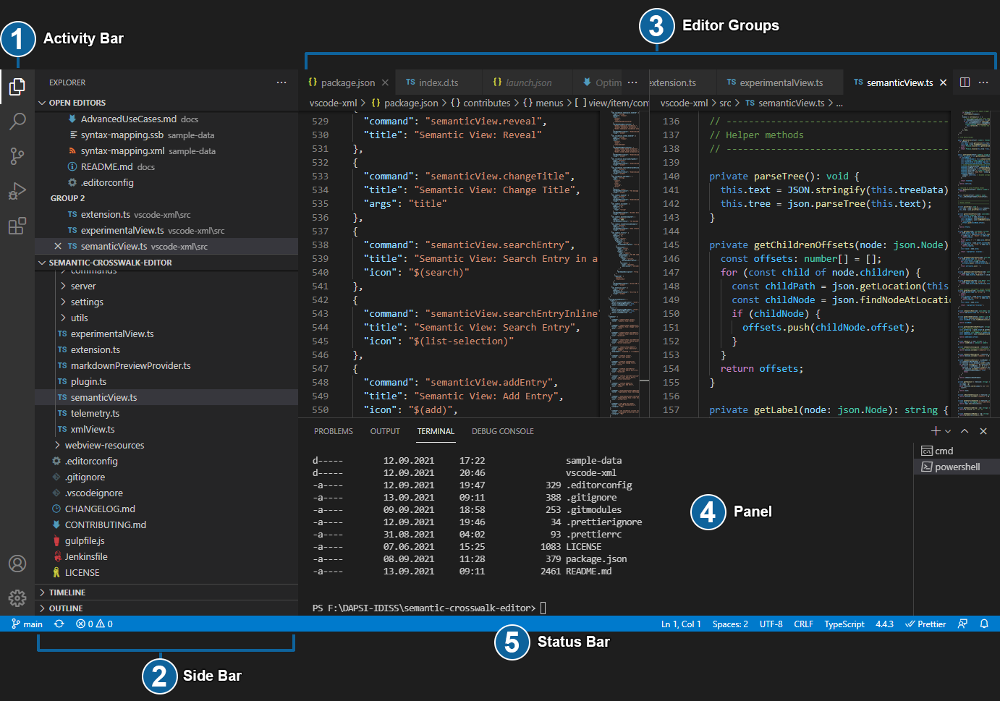
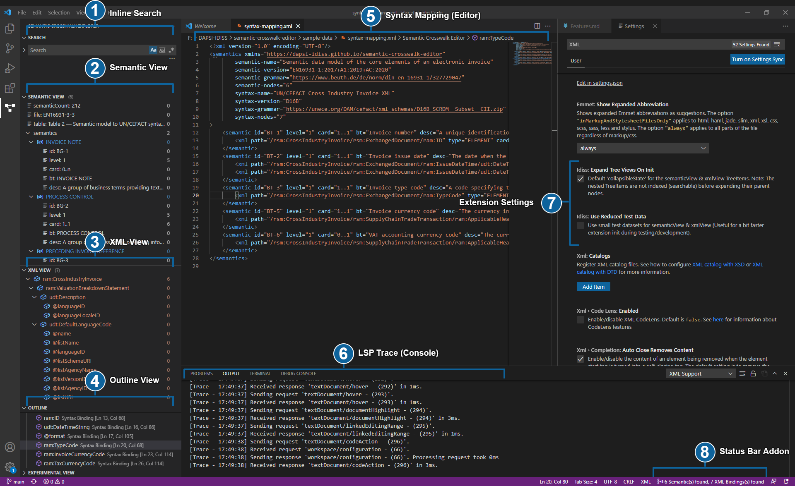

# Getting Started

## Installation

1. Download and install [Microsoft Visual Studio Code](https://code.visualstudio.com/) (hereinafter referred to as VS Code)
1. Download the latest release of the [Semantic-Crosswalk-Editor Extension](https://github.com/DAPSI-IDISS/semantic-crosswalk-editor/releases/tag/v0.18.1) (Assets ➜ VSIX file)
1. Launch VS Code  
1. Go to Extensions in the Activity Bar (`Ctrl+Shift+X`)  

1. Select the **[...]** menu at the top and **Install from VSIX...**  

1. In the **Install from VSIX** open file dialog, select the previously downloaded Semantic-Crosswalk-Editor VSIX file from Step 2 (e.g. `semantic-crosswalk-editor-0.18.1.vsix`)  
  
(A new menu will appear in the Activity Bar indicating that the extension was installed succesfully)
1. Select the Semantic Crosswalk Explorer menu and open a XML, XSD or SSB file to activate the extension features (See [Open the Syntax-Mapping Sample File](#open-the-syntax-mapping-sample-file) next)  

## Open the Syntax-Mapping Sample File

To quickly get started, download the [Syntax-Mapping sample file](./../sample-data/syntax-mapping.xml) from the GitHub repository and open it in VS Code. This sample will be also used in the following documentation to provide a straight forward walkthrough.

Make sure to trust the file (Open) when the following prompt appears:  
 

### Default Workspace Sample

The default VS Code workspace with the extension enabled and the sample file opened should look like the following image:  
  

## User Interface Overview

The following screen describes the different sections of the UI and the related terms (conventional VS Code terms) used across this documentation.

  

VS Code comes with a simple and intuitive layout that maximizes the space provided for the editor while leaving ample room to browse and access the full context of your folder or project. The UI is divided into five areas:

* **(1) Activity Bar** - Located on the far left-hand side, this lets you switch between views and gives you additional context-specific indicators, like the number of outgoing changes when Git is enabled.  
* **(2) Side Bar** - Contains different views like the Explorer to assist you while working on your project.  
* **(3) Editor Groups** - The main area to edit your files. You can open as many editors as you like side by side vertically and horizontally.  
* **(4) Panel** - You can display different panels below the editor region for output or debug information, errors and warnings, or an integrated terminal. Panel can also be moved to the right for more vertical space.  
* **(5) Status Bar** - Information about the opened project and the files you edit.  

Each time you start VS Code, it opens up in the same state it was in when you last closed it. The folder, layout, and opened files are preserved.  
Open files in each editor are displayed with tabbed headers (Tabs) at the top of the editor region.

## Semantic-Crosswalk-Editor Sections

These sections and their associated terms are specific to the Semantic Crosswalk Editor extension and used as conventions in this documentation.

  

## Additional Information

More information concerning the general UI features of VS Code and introductory guides:

* [Intro Videos](https://code.visualstudio.com/docs/getstarted/introvideos)
* [Tips and Tricks](https://code.visualstudio.com/docs/getstarted/tips-and-tricks)
* [User Interface](https://code.visualstudio.com/docs/getstarted/userinterface)

## Read Next

  * [Optimizing Workspace](OptimizingWorkspace.md) **(Recommended)**
  * [Features](Features.md) *(If you just want a quick jump to the key features)*
