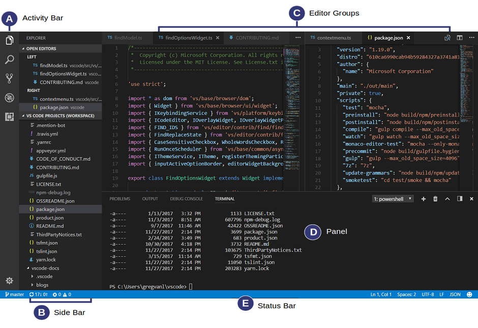

# Getting Started

## Installation

1. Download and install [Microsoft Visual Studio Code](https://code.visualstudio.com/) (hereinafter referred to as VS Code)
1. Download the latest release of the [Semantic-Crosswalk-Editor Extension](https://github.com/DAPSI-IDISS/semantic-crosswalk-editor/releases/tag/v0.18.1) and extract the zip/tar file
1. Launch VS Code  
1. Go to Extensions in the Activity Bar (`Ctrl+Shift+X`)  

1. Select the **[...]** menu at the top and **Install from VSIX...**  

1. In the **Install from VSIX** open file dialog, select the previously extracted Semantic-Crosswalk-Editor VSIX file from Step 2 (e.g. `semantic-crosswalk-editor-0.18.1.vsix`)  
  
(A new menu will appear in the Activity Bar indicating that the extension was installed succesfully)
1. Select the Semantic Crosswalk Explorer menu and open a XML, XSD or SSB file to activate the extension features (See [Open the Syntax-Mapping Sample File](#open-the-syntax-mapping-sample-file) next)  

## Open the Syntax-Mapping Sample File

To quickly get started, download the [Syntax-Mapping sample file](./../sample-data/syntax-mapping.xml) from the GitHub repository and open it in VS Code. This sample will be also used in the following documentation to provide a straight forward walkthrough.

Make sure to trust the file (Open) when the following prompt appears:  
 

### Default Workspace Sample

The default VS Code workspace with the extension enabled and the sample file opened should look like the following image:  
  

## User Interface Overview

The following screen describes the different sections of the UI and the related terms (conventional VS Code terms) used across this documentation.

  
!TODO: Replace with own image

### Semantic-Crosswalk-Editor Sections

!TODO: Image describing our sections

## Additional Information

!TODO: VSCode docu "Getting Started" links

## Read Next

  * [Optimizing Workspace](OptimizingWorkspace.md) **(Recommended)**
  * [Features](Features.md) *(If you just want a quick jump to the key features)*
