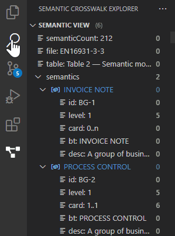
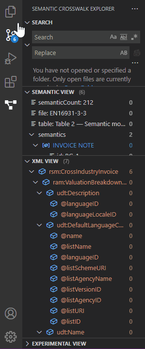
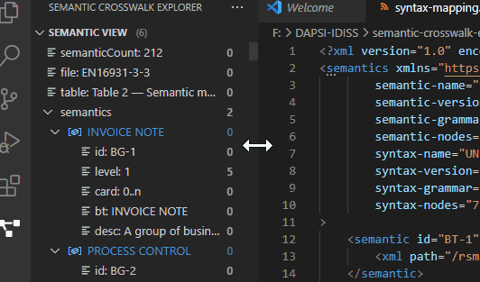
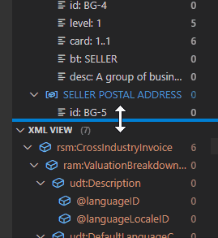
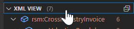

# Optimizing Workspace

## Move Inline Search to Semantic Crosswalk Explorer

Drag the Search Icon from the Activity Bar into the Semantic Crosswalk Explorer to move the Search View above Semantic View (this step is highly recommended to improve the workflow with the inline search features):

## Move Outline to Semantic Crosswalk Explorer

Drag the Outline from the Explorer into the Semantic Crosswalk Explorer to move the Outline View below XML View (this way you get all relevant core views combined into one neat panel):

## Adjust Side Panel & Views Size

Drag the line between the Side Panel and the Code Editor to adjust for your needs:

Drag the lines between the Views for a better overview in the Side Panel depending on your use-case:

Views can be also completely collapsed/expanded by clicking on the arrow icons (`v` or `>` before the LABEL) or directly on the LABEL (e.g. on "XML VIEW"):

